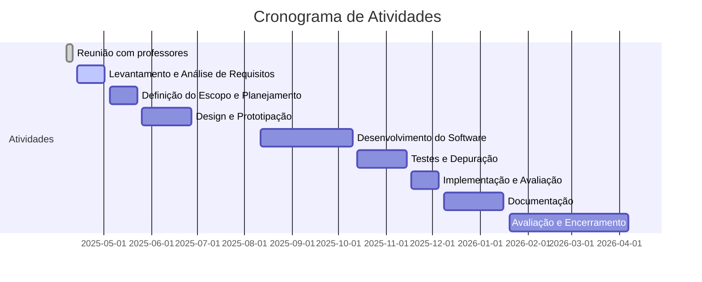

# **Projeto de extensão Universitária: ISIS - Inovação em sistemas de informação**

# Sumário

- [**Projeto de extensão Universitária: ISIS - Inovação em sistemas de informação**](#projeto-de-extensão-universitária-isis---inovação-em-sistemas-de-informação)
- [Sumário](#sumário)
- [1. Dados do projeto](#1-dados-do-projeto)
- [2. Detalhes da Ação](#2-detalhes-da-ação)
  - [2.1. Justificativa:](#21-justificativa)
  - [2.2. Resumo:](#22-resumo)
  - [2.3. Fundamentação Teórica:](#23-fundamentação-teórica)
  - [2.4. Metodologia:](#24-metodologia)
    - [1. Levantamento e Análise de Requisitos Objetivo:](#1-levantamento-e-análise-de-requisitos-objetivo)
    - [2. Definição do Escopo e Planejamento Objetivo:](#2-definição-do-escopo-e-planejamento-objetivo)
    - [3. Design e Prototipação Objetivo:](#3-design-e-prototipação-objetivo)
    - [4. Desenvolvimento do Software Objetivo:](#4-desenvolvimento-do-software-objetivo)
    - [5. Testes e Depuração Objetivo:](#5-testes-e-depuração-objetivo)
    - [6. Implementação e Avaliação Objetivo:](#6-implementação-e-avaliação-objetivo)
    - [7. Documentação e Disseminação Objetivo:](#7-documentação-e-disseminação-objetivo)
    - [8. Avaliação e Encerramento Objetivo:](#8-avaliação-e-encerramento-objetivo)
  - [2.5. Referências:](#25-referências)
  - [2.6. Objetivos Gerais:](#26-objetivos-gerais)
  - [2.7. Resultados Esperados:](#27-resultados-esperados)
- [3. Recursos Necessários](#3-recursos-necessários)
- [4. Membros da equipe](#4-membros-da-equipe)
- [5. Gantt](#5-gantt)
- [6. Referências](#6-referências)
- [7. Licença](#7-licença)

---
# 1. Dados do projeto

Código:	PJ134-2025
Título:	ISIS
Ano:	2025
Data de Cadastro:	27/11/2024
Período:	07/04/2025 a 07/04/2026
Tipo:	PROJETO
Situação:	EM EXECUÇÃO

Área Principal:	TECNOLOGIA E PRODUÇÃO
Área do CNPq:	Ciências Exatas e da Terra
Fonte de Financiamento:	AÇÃO AUTO-FINANCIADA

[Voltar ao sumário](#sumário)

---
# 2. Detalhes da Ação

## 2.1. Justificativa:

O projeto de extensão desempenha um papel fundamental no fortalecimento da atuação da universidade como agente de transformação social e econômica na região. Por meio da execução de atividades diretamente em empresas locais, o projeto amplia as fronteiras acadêmicas ao levar estudantes de Sistemas de Informação para vivenciar desafios reais no desenvolvimento de soluções digitais. Essas empresas, frequentemente limitadas em recursos para investir em tecnologia, beneficiam-se de soluções personalizadas e acessíveis que otimizam seus processos e aumentam sua competitividade. Essa abordagem prática proporciona aos alunos uma experiência imersiva no ambiente profissional, permitindo que atuem como desenvolvedores de software em cenários reais, sob a supervisão de professores. Ao lidar com demandas concretas das empresas, os estudantes desenvolvem competências técnicas e habilidades socioemocionais, como trabalho em equipe, comunicação com clientes e resolução de problemas. O engajamento nas empresas não apenas qualifica os alunos para o mercado, mas também reforça o compromisso social da universidade, criando um impacto positivo duradouro para o desenvolvimento regional e para a formação de futuros profissionais capacitados.

[Voltar ao sumário](#sumário)

## 2.2. Resumo:

O projeto Inovação em Sistemas de Informação (ISIS) unifica inovação tecnológica e impacto social ao criar produtos tecnológicos à comunidade e preparar os graduandos para o futuro. Este projeto de extensão universitária se destaca por sua proposta inovadora e transformadora. Através do desenvolvimento de sistemas de informação personalizados, utilizando tecnologias de ponta, buscamos atender às demandas mais urgentes da comunidade local, promovendo o seu desenvolvimento social e econômico. Para os graduandos, o projeto oferece uma experiência prática imersiva, onde podem aplicar o conhecimento teórico adquirido em sala de aula, desenvolver novas habilidades e aprimorar seu perfil profissional. Ao final deste projeto de extensão, espera-se que as necessidades das empresas locais sejam atendidas por meio do desenvolvimento de soluções de software específicas, com a implementação efetiva dessas ferramentas nas organizações da cidade. O objetivo é gerar benefícios tangíveis para as empresas da comunidade, demonstrando o potencial dos acadêmicos na resolução de problemas reais e no apoio ao crescimento econômico local. Como resultado, espera-se que os alunos adquiram um conjunto sólido de habilidades técnicas e competências profissionais, capacitando-os a enfrentar com sucesso os desafios do mercado de trabalho, ao mesmo tempo em que contribuem para o fortalecimento do ecossistema empresarial regional.

[Voltar ao sumário](#sumário)

## 2.3. Fundamentação Teórica:

O desenvolvimento do software web online, desktop e protótipos, para atender demandas locais é embasado em uma série de conceitos e teorias relevantes. A seguir, são apresentados alguns elementos teóricos fundamentais que sustentam este projeto: Desenvolvimento de Software: O projeto baseia-se em princípios e metodologias de desenvolvimento de software, que envolvem o ciclo de vida do software, técnicas de programação, testes, manutenção e documentação. Esses fundamentos asseguram que o software seja construído de forma estruturada, segura e eficiente, seguindo boas práticas de engenharia de software. Tecnologias Web Modernas: O projeto se utiliza de tecnologias web atualizadas, como linguagens de programação (JavaScript, Python, C, C++ e C#), frameworks (como Vuejs, Nuxtjs, Flask, Laravel), bancos de dados (MySQL, PostgreSQL, MongoDB, Firebase, SQL Server e Oracle) e outras ferramentas relevantes. A escolha dessas tecnologias leva em consideração os avanços recentes no desenvolvimento web e sua adequação para atender às demandas específicas do projeto. Análise de Requisitos: A fundamentação teórica inclui técnicas de análise de requisitos, que envolvem a identificação e compreensão das necessidades dos usuários finais. Essa etapa é essencial para garantir que o software desenvolvido atenda às demandas locais de maneira eficiente e adequada. Usabilidade e Experiência do Usuário: São abordados conceitos de usabilidade e experiência do usuário (UX), com o objetivo de desenvolver uma interface amigável e intuitiva. Teorias relacionadas à interação humano-computador, ergonomia cognitiva e design centrado no usuário são aplicadas para garantir que o software seja de fácil utilização e proporcione uma experiência positiva aos usuários. Responsabilidade Social: O projeto se apoia em princípios de responsabilidade social, que envolvem a busca por soluções tecnológicas que contribuam para o desenvolvimento sustentável da comunidade local. Teorias relacionadas à ética na tecnologia e à responsabilidade social corporativa fornecem uma base para o desenvolvimento de soluções que levem em consideração o impacto social e ambiental. Colaboração e Trabalho em Equipe: A fundamentação teórica engloba conceitos de colaboração e trabalho em equipe, estimulando a cooperação entre os membros do projeto. Teorias relacionadas à comunicação efetiva, gestão de projetos e liderança são aplicadas para garantir que o trabalho em equipe seja produtivo, colaborativo e eficiente. Esses fundamentos teóricos fornecem a base para o desenvolvimento do projeto de extensão universitária, garantindo que as melhores práticas de desenvolvimento de software, tecnologias web modernas, análise de requisitos, usabilidade, responsabilidade social e colaboração sejam aplicadas de maneira adequada. Isso assegura a qualidade e a relevância do software web desenvolvido, bem como a formação dos acadêmicos envolvidos.

[Voltar ao sumário](#sumário)

## 2.4. Metodologia:

### 1. Levantamento e Análise de Requisitos Objetivo: 

Identificar as necessidades e demandas específicas das empresas ou da comunidade local. Ação sugerida: Os alunos realizarão visitas e entrevistas com stakeholders (empresas da comunitários e/ou seus usuários finais), com o objetivo de mapear os requisitos de necessidades de sistemas. Será incentivada a aplicação de levantamento de dados. Este processo estimula a articulação do ensino com a pesquisa ao explorar metodologias de análise de requisitos com base em estudos de caso reais. 

[Voltar ao sumário](#sumário)

### 2. Definição do Escopo e Planejamento Objetivo: 

Delimitar claramente as funcionalidades, prazos e recursos necessários para o desenvolvimento do projeto. Ação sugerida: A partir da análise de requisitos, os alunos, sob a orientação dos professores, irão definir o escopo do projeto, especificando as funcionalidades essenciais para um futuro desenvolvimento. Será abordada a metodologia ágil de gestão de projetos. A prática de planejamento reforça o vínculo entre teoria e prática, preparando os alunos para cenários empresariais dinâmicos. 

[Voltar ao sumário](#sumário)

### 3. Design e Prototipação Objetivo: 
   
Criar protótipos e de interface para testar ideias iniciais com os stakeholders. Ação sugerida: Nesta fase, os alunos irão desenvolver wireframes, protótipos interativos e/ou modelos de interface de usuário (UI) utilizando ferramentas de design . A prototipação será realizada em estreita colaboração com os stakeholders, incluindo feedback constante das empresas. Este processo permitirá que os alunos explorem abordagens de design e também coloquem em prática conceitos de pesquisa em interação humano-computador (HCI). Além disso, os alunos terão a oportunidade de realizar testes com usuários reais.

[Voltar ao sumário](#sumário)

### 4. Desenvolvimento do Software Objetivo: 
   
Codificar as funcionalidades do sistema conforme os requisitos definidos e o design elaborado. Ação sugerida: A fase de desenvolvimento será realizada com o auxílio de ferramentas e linguagens de programação adequadas ao tipo de software ou protótipo (web, IoT, desktop). Os alunos irão aplicar conceitos de engenharia de software, como versionamento de código e boas práticas de desenvolvimento e documentação. Criando uma forte articulação entre teoria acadêmica e as demandas do mercado de trabalho. 

[Voltar ao sumário](#sumário)

### 5. Testes e Depuração Objetivo: 

Garantir que o software funcione corretamente e esteja livre de erros. Ação sugerida: Os alunos irão realizar uma série de testes, incluindo testes de funcionalidade, usabilidade e performance. Durante essa fase, será enfatizada a importância de testes no contexto empresarial, permitindo que os alunos articulem a teoria de testes com os desafios reais encontrados durante o desenvolvimento. 

[Voltar ao sumário](#sumário)

### 6. Implementação e Avaliação Objetivo:

Colocar o software ou protótipo em funcionamento no ambiente real e coletar feedback. Ação sugerida: Após o desenvolvimento, os alunos participarão da implantação do sistema no ambiente real das empresas. Será realizado um monitoramento do desempenho do software, juntamente com a coleta de feedback dos usuários finais. Os alunos poderão aplicar surveys ou entrevistas, para verificar a solução. 

[Voltar ao sumário](#sumário)

### 7. Documentação e Disseminação Objetivo: 

Documentar o processo e os resultados do projeto para disseminação do conhecimento gerado. Ação sugerida: A documentação do projeto será realizada pelos alunos, incluindo a descrição dos requisitos, processos de desenvolvimento, código-fonte, testes realizados, e feedback dos usuários. A disseminação de resultados servirá tanto para enriquecer o aprendizado dos alunos quanto para impactar positivamente as empresas e outros trabalhos acadêmicos futuros.

[Voltar ao sumário](#sumário)

### 8. Avaliação e Encerramento Objetivo: 
   
Avaliar os resultados do projeto e refletir sobre o aprendizado adquirido. Ação sugerida: A avaliação final do projeto será realizada com reunião com os alunos, comentando cada dificuldade e avanço ao longo do projeto (simila a sprint de retrospectiva Scrum), promovendo um espaço de reflexão sobre o processo de desenvolvimento. O encerramento do projeto envolverá a análise do impacto gerado nas empresas e a possibilidade de continuidade ou expansão do projeto para novas demandas. 

[Voltar ao sumário](#sumário)

## 2.5. Referências:
>> Monteiro, Emiliano Soares. Projeto de sistemas e bancos de dados. Rio de Janeiro: Brasport, 2004. 321. ISBN: 8574521760 >> Sommerville, I. (2016). Engenharia de software. Pearson Education Brasil. >> Hoyos, C., & Bies, J. (2020). Fullstack React: The Complete Guide to ReactJS and Friends. Fullstack.io. >> DuBois, P. (2012). MySQL Cookbook: Solutions for Database Developers and Administrators. O'Reilly Media. >> RESSMAN, Roger S.. Engenharia de Software. 6ed. São Paulo: MCGRAW HILL - ARTMED, 2011.

[Voltar ao sumário](#sumário)

## 2.6. Objetivos Gerais:

O objetivo geral deste projeto de extensão universitária é promover a interação entre a universidade e as empresas locais por meio do desenvolvimento de softwares web, IoT, desktop e protótipos utilizando tecnologias modernas. O projeto visa capacitar os acadêmicos de Sistemas de Informação, permitindo-lhes aplicar o conhecimento adquirido em sala de aula na resolução de problemas reais enfrentados pelas empresas da cidade. Dessa forma, busca-se atender às demandas específicas da comunidade empresarial, oferecendo soluções personalizadas que contribuam para a modernização e eficiência dos processos locais. Além disso, o projeto se propõe a desenvolver softwares de alta qualidade, com interfaces intuitivas, desempenho otimizado e segurança robusta, ao mesmo tempo em que proporciona aos estudantes uma experiência prática enriquecedora. Essa vivência inclui o desenvolvimento de habilidades técnicas e socioemocionais, como trabalho em equipe, gestão de projetos e resolução de problemas, preparando-os para o mercado de trabalho enquanto reforça o compromisso social da universidade com o desenvolvimento regional.

[Voltar ao sumário](#sumário)

## 2.7. Resultados Esperados:

Alunos capacitados nas atividades relacionadas com engenharia de software, banco de dados e desenvolvimento de sistemas (dentre outras: atendimento as demandas locais da comunidade, preparação para o mercado de trabalho pela vivência com o processo de desenvolvimento em empresas), possibilidade de publicação de artigo relatando experiências inclusive de registro de software. Empresas e suas necessidades atendidas pelos alunos.

[Voltar ao sumário](#sumário)

---
# 3. Recursos Necessários

Professores orientadores do curso de Sistemas de Informação
Sala de atendimento e orientação para alunos e empresas
Computadores e notebooks para desenvolvimento
Ferramentas de software necessárias para o desenvolvimento dos sistemas

[Voltar ao sumário](#sumário)

---
# 4. Membros da equipe

|Nome| Categoria | Função | Unidade | Início | Fim |
|--  | --        | --     | --      | --     | -- |
|1. [BENEVID FELIX DA SILVA](http://lattes.cnpq.br/8141409167616604) | DOCENTE |MEMBRO |SNP-FACET |01/12/2024 |30/11/2025|
|2. [EMILIANO SOARES MONTEIRO](http://lattes.cnpq.br/5364435745021797) | DOCENTE| MEMBRO| SNP-FACET |01/12/2024| 30/11/2025|
|3. [FRANCISCO SANCHES BANHOS FILHO](http://lattes.cnpq.br/1439145344156787) | DOCENTE| MEMBRO| SNP-FACET| 01/12/2024| 30/11/2025|
|4. [IVAN LUIZ PEDROSO PIRES](http://lattes.cnpq.br/3741140002994653) | DOCENTE| COORDENADOR(A)| SNP-FACET| 01/12/2024| 30/11/2025|

[Voltar ao sumário](#sumário)

# 5. Gantt

teste

[Voltar ao sumário](#sumário)

---
# 6. Referências

Sommerville, I. (2016). Engenharia de software. Pearson Education Brasil. W3Schools. (Disponível em: https://www.w3schools.com/) 

Carlos, TERUEL, E. HTML 5 - Guia Prático. Editora Saraiva, 06/2014 Flanagan, D. (2016). The Definitive Guide: Activate Your Web Pages. O'Reilly Media. 

Lerdorf, R., Tatroe, K., & MacIntyre, P. (2021). Programming PHP: Creating Dynamic Web Pages. O'Reilly Media. 

Chinnathambi, S. (2020). Learning Vue.js 2: Learn how to build amazing and complex reactive web applications easily with Vue.js. Packt Publishing. 

Hoyos, C., & Bies, J. (2020). Fullstack React: The Complete Guide to ReactJS and Friends. Fullstack.io. 

DuBois, P. (2012). MySQL Cookbook: Solutions for Database Developers and Administrators. O'Reilly Media. 

Banks, J., Muller, P., & Tufo, H. (2018). PostGIS in Action. Manning Publications.

[1] https://datampe.sebrae.com.br/profile/geo/sinop-mt

[2] https://cdlsinop.com.br/comunicacao/noticias/com-mais-de-53-mil-novas-empresas-sinop-fecha-ano-com-fortalecimento-economico/10430#:~:text=A%20maior%20cidade%20do%20Nort%C3%A3o,regi%C3%A3o%20Norte%20de%20Mato%20Grosso

[Voltar ao sumário](#sumário)

---
# 7. Licença

<a property="dct:title" rel="cc:attributionURL" href="https://github.com/monteiro74/projeto_isis">https://github.com/monteiro74/projeto_isis</a> by Professores Dr. Monteiro, Emiliano e Dr. Pires, Ivan is licensed under <a href="https://creativecommons.org/licenses/by-nc-nd/4.0/?ref=chooser-v1" target="_blank" rel="license noopener noreferrer" style="display:inline-block;">CC BY-NC-ND 4.0</a>

Link para a licença: https://creativecommons.org/licenses/by-nc-nd/4.0/legalcode.en

[Voltar ao sumário](#sumário)

