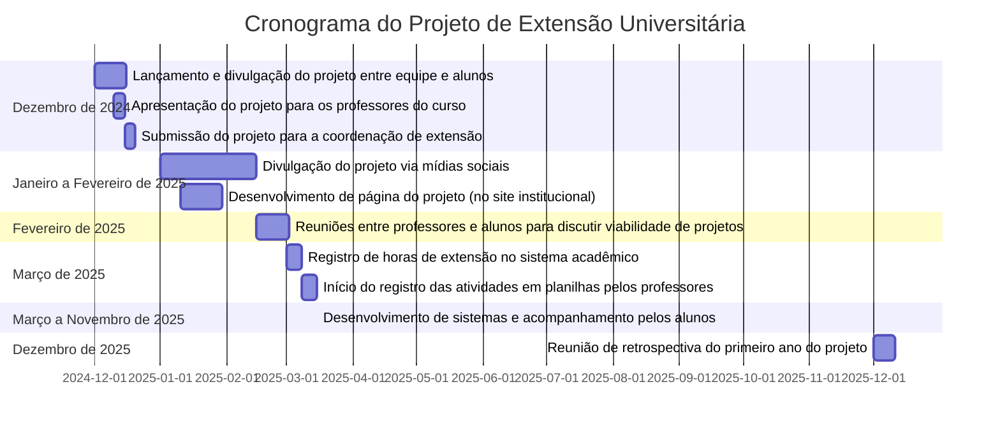

# **Projeto de extensão: ISIS - Inovação em sistemas de informação**

# Sumário

- [**Projeto de extensão: ISIS - Inovação em sistemas de informação**](#projeto-de-extensão-isis---inovação-em-sistemas-de-informação)
- [Sumário](#sumário)
- [Resumo:](#resumo)
- [1. Introdução](#1-introdução)
  - [1.1. Fundamentação teórica](#11-fundamentação-teórica)
- [2. Justificativa](#2-justificativa)
- [3. Objetivo geral](#3-objetivo-geral)
  - [3.1. Objetivo específico](#31-objetivo-específico)
- [4. Público-Alvo](#4-público-alvo)
- [5. Metodologia](#5-metodologia)
  - [5.1. Metodologia do projeto de extensão](#51-metodologia-do-projeto-de-extensão)
  - [5.2. Metodologia para o projeto técnico (para os alunos)](#52-metodologia-para-o-projeto-técnico-para-os-alunos)
  - [5.3. Comparação (métodologia para os professores x metodologia para os alunos)](#53-comparação-métodologia-para-os-professores-x-metodologia-para-os-alunos)
- [6. Recursos Necessários](#6-recursos-necessários)
  - [6.1. Membros da equipe](#61-membros-da-equipe)
- [7. Cronograma](#7-cronograma)
  - [7.1. Gantt](#71-gantt)
  - [7.2. Cronograma para os alunos](#72-cronograma-para-os-alunos)
- [8. Resultados](#8-resultados)
  - [8.1. Resultados específicos](#81-resultados-específicos)
- [9. Monitoramento e Avaliação](#9-monitoramento-e-avaliação)
- [10. Orçamento](#10-orçamento)
- [11. Referências](#11-referências)

---
# Resumo:

O projeto Inovação em Sistemas de Informação (ISIS) unifica inovação tecnológica e impacto social ao criar produtos tecnológicos à comunidade e preparar os graduandos para o futuro. Este projeto de extensão universitária se destaca por sua proposta inovadora e transformadora. Através do desenvolvimento de sistemas de informação personalizados, utilizando tecnologias de ponta, buscamos atender às demandas mais urgentes da comunidade local, promovendo o seu desenvolvimento social e econômico. Para os graduandos, o projeto oferece uma experiência prática imersiva, onde podem aplicar o conhecimento teórico adquirido em sala de aula, desenvolver novas habilidades e aprimorar seu perfil profissional. Mais do que isso, o projeto incentiva a busca por novos aprendizados e a construção de uma visão crítica e proativa diante dos desafios do mercado de trabalho. Acreditamos que a união entre conhecimento acadêmico e tecnologia inovadora pode gerar soluções reais e impactantes para a comunidade. 

Através deste projeto, buscamos contribuir para a construção de um futuro mais próspero e sustentável para todos. Os softwares web serão projetados com base em uma análise minuciosa das necessidades específicas da comunidade local. O objetivo é fornecer soluções eficientes e inovadoras para os problemas identificados, visando ao benefício direto dos usuários locais. O projeto prioriza, portanto, a responsabilidade social e a colaboração com a comunidade. Serão utilizadas tecnologias modernas de desenvolvimento web, que estão em alta demanda no mercado atual. Isso permitirá que os acadêmicos adquiram habilidades práticas em tecnologias relevantes, como linguagens de programação, frameworks, bancos de dados e outras ferramentas essenciais para o desenvolvimento de software web. Um aspecto fundamental do projeto de extensão é a promoção do trabalho em equipe e da colaboração. Os acadêmicos serão incentivados a trabalhar de forma conjunta, compartilhando conhecimento, ideias e resolvendo desafios técnicos juntos. Além disso, contarão com a orientação de professores e profissionais da área, que auxiliarão no desenvolvimento de habilidades e competências. 

~~Ao final do projeto, espera-se que as demandas da sociedade sejam atendidas e os softwares produzidos sejam utilizados pela comunidade local, trazendo benefícios tangíveis e demonstrando o potencial dos acadêmicos em solucionar problemas reais. Com consequência, espera-se que os acadêmicos tenham adquirido um conjunto sólido de habilidades técnicas e competências profissionais, capacitando-os para enfrentar os desafios do mercado de trabalho.~~

Ao final deste projeto de extensão, espera-se que as necessidades das empresas locais sejam atendidas por meio do desenvolvimento de soluções de software específicas, com a implementação efetiva dessas ferramentas nas organizações da cidade. O objetivo é gerar benefícios tangíveis para as empresas da comunidade, demonstrando o potencial dos acadêmicos na resolução de problemas reais e no apoio ao crescimento econômico local. Como resultado, espera-se que os alunos adquiram um conjunto sólido de habilidades técnicas e competências profissionais, capacitando-os a enfrentar com sucesso os desafios do mercado de trabalho, ao mesmo tempo em que contribuem para o fortalecimento do ecossistema empresarial regional.

[Voltar ao sumário](#sumário)

---
# 1. Introdução

~~Este projeto de extensão tem como objetivo aproximar a universidade da comunidade local, promovendo o atendimento de demandas empresariais, fornecendo experiência prática para os alunos e incentivando a troca de conhecimento entre alunos e professores. A cidade, inserida em um contexto de agronegócio e pequenas indústrias, possui necessidades específicas na área de desenvolvimento de software que podem ser atendidas pelo curso de Sistemas de Informação. Com isso, o projeto visa não apenas qualificar os alunos, mas também oferecer suporte tecnológico a pequenas empresas, gerando impacto social e econômico.~~

Este projeto de extensão tem como objetivo aproximar a universidade das empresas da comunidade local, atendendo às demandas empresariais e promovendo o desenvolvimento de soluções tecnológicas específicas para esse público. Através da atuação de alunos do curso de Sistemas de Informação, o projeto busca oferecer suporte prático e inovador às pequenas empresas da cidade, que estão inseridas no contexto do agronegócio e das indústrias locais. Além de proporcionar uma valiosa experiência prática para os alunos, o projeto visa fomentar a troca de conhecimentos entre estudantes, professores e empresários, criando um ambiente de colaboração mútua. Ao atender às necessidades tecnológicas dessas empresas, o projeto contribui para a qualificação dos alunos e gera um impacto positivo no desenvolvimento social e econômico da região.

[Voltar ao sumário](#sumário)

## 1.1. Fundamentação teórica

O desenvolvimento do software web online para atender demandas locais é embasado em uma série de conceitos e teorias relevantes. A seguir, são apresentados alguns elementos teóricos fundamentais que sustentam este projeto: 

1) Desenvolvimento de Software: O projeto baseia-se em princípios e metodologias de desenvolvimento de software, que envolvem o ciclo de vida do software, técnicas de programação, testes, manutenção e documentação. Esses fundamentos asseguram que o software seja construído de forma estruturada, segura e eficiente, seguindo boas práticas de engenharia de software. 

2) Tecnologias Web Modernas: O projeto se utiliza de tecnologias web atualizadas, como linguagens de programação (por exemplo, HTML, CSS, JavaScript, Python), frameworks (como Vuejs, Nuxtjs, Flask), bancos de dados (MySQL, PostgreSQL, MongoDB, Firebase) e outras ferramentas relevantes. A escolha dessas tecnologias leva em consideração os avanços recentes no desenvolvimento web e sua adequação para atender às demandas específicas do projeto. 
   
3) Análise de Requisitos: A fundamentação teórica inclui técnicas de análise de requisitos, que envolvem a identificação e compreensão das necessidades dos usuários finais. Essa etapa é essencial para garantir que o software desenvolvido atenda às demandas locais de maneira eficiente e adequada. 
   
4) Usabilidade e Experiência do Usuário: São abordados conceitos de usabilidade e experiência do usuário (UX), com o objetivo de desenvolver uma interface amigável e intuitiva. Teorias relacionadas à interação humano-computador, ergonomia cognitiva e design centrado no usuário são aplicadas para garantir que o software seja de fácil utilização e proporcione uma experiência positiva aos usuários. 
   
5) Responsabilidade Social: O projeto se apoia em princípios de responsabilidade social, que envolvem a busca por soluções tecnológicas que contribuam para o desenvolvimento sustentável da comunidade local. Teorias relacionadas à ética na tecnologia e à responsabilidade social corporativa fornecem uma base para o desenvolvimento de soluções que levem em consideração o impacto social e ambiental. 
 
6) Colaboração e Trabalho em Equipe: A fundamentação teórica engloba conceitos de colaboração e trabalho em equipe, estimulando a cooperação entre os membros do projeto. Teorias relacionadas à comunicação efetiva, gestão de projetos e liderança são aplicadas para garantir que o trabalho em equipe seja produtivo, colaborativo e eficiente. Esses fundamentos teóricos fornecem a base para o desenvolvimento do projeto de extensão universitária, garantindo que as melhores práticas de desenvolvimento de software, tecnologias web modernas, análise de requisitos, usabilidade, responsabilidade social e colaboração sejam aplicadas de maneira adequada. Isso assegura a qualidade e a relevância do software web desenvolvido, bem como a formação dos acadêmicos envolvidos.

[Voltar ao sumário](#sumário)

---
# 2. Justificativa
   
~~O projeto de extensão é essencial para fortalecer a atuação da universidade como agente de transformação social e econômica na região. Ao envolver estudantes de Sistemas de Informação no desenvolvimento de soluções digitais, ele possibilita uma abordagem prática do aprendizado, que vai além das fronteiras acadêmicas e alcança diretamente as necessidades de empresas locais. Essas empresas, muitas vezes com recursos limitados para investir em tecnologia, beneficiam-se de soluções acessíveis e personalizadas que otimizam seus processos e competitividade.~~

~~Além disso, o projeto proporciona aos alunos uma experiência única de imersão no ambiente profissional, onde são incentivados a exercer o papel de desenvolvedores de software em situações reais. Esse engajamento, sob a supervisão dos professores, permite que adquiram competências técnicas e habilidades socioemocionais, como trabalho em equipe, comunicação com o cliente e resolução de problemas. Esse processo, aliado ao compromisso social da universidade, promove um ciclo virtuoso: os alunos se qualificam para o mercado enquanto apoiam o desenvolvimento das pequenas empresas locais, criando um impacto positivo duradouro tanto para a economia regional quanto para a formação dos futuros profissionais.~~

O projeto de extensão desempenha um papel fundamental no fortalecimento da atuação da universidade como agente de transformação social e econômica na região. Por meio da execução de atividades diretamente em empresas locais, o projeto amplia as fronteiras acadêmicas ao levar estudantes de Sistemas de Informação para vivenciar desafios reais no desenvolvimento de soluções digitais. Essas empresas, frequentemente limitadas em recursos para investir em tecnologia, beneficiam-se de soluções personalizadas e acessíveis que otimizam seus processos e aumentam sua competitividade.

Essa abordagem prática proporciona aos alunos uma experiência imersiva no ambiente profissional, permitindo que atuem como desenvolvedores de software em cenários reais, sob a supervisão de professores. Ao lidar com demandas concretas das empresas, os estudantes desenvolvem competências técnicas e habilidades socioemocionais, como trabalho em equipe, comunicação com clientes e resolução de problemas. O engajamento nas empresas não apenas qualifica os alunos para o mercado, mas também reforça o compromisso social da universidade, criando um impacto positivo duradouro para o desenvolvimento regional e para a formação de futuros profissionais capacitados.

[Voltar ao sumário](#sumário)

---
# 3. Objetivo geral

~~O objetivo geral deste projeto de extensão universitária é desenvolver softwares web online, utilizando tecnologias modernas, que atenda às demandas da sociedade local. O projeto busca proporcionar aos acadêmicos a oportunidade de aplicar o conhecimento adquirido em sala de aula e se prepararem para o mercado de trabalho. Ao desenvolver o software, pretende-se criar uma solução que aborde problemas específicos da comunidade local, oferecendo funcionalidades relevantes e adequadas às necessidades identificadas. O objetivo é desenvolver softwares web de qualidade, com uma interface intuitiva, desempenho otimizado e segurança robusta. Além disso, o projeto busca promover a formação e capacitação dos acadêmicos envolvidos, permitindo-lhes adquirir experiência prática no desenvolvimento de software web, bem como desenvolver habilidades de trabalho em equipe, gerenciamento de projetos e resolução de problemas.~~

O objetivo geral deste projeto de extensão universitária é promover a interação entre a universidade e as empresas locais por meio do desenvolvimento de softwares web utilizando tecnologias modernas. O projeto visa capacitar os acadêmicos de Sistemas de Informação, permitindo-lhes aplicar o conhecimento adquirido em sala de aula na resolução de problemas reais enfrentados pelas empresas da cidade. Dessa forma, busca-se atender às demandas específicas da comunidade empresarial, oferecendo soluções personalizadas que contribuam para a modernização e eficiência dos processos locais.

Além disso, o projeto se propõe a desenvolver softwares de alta qualidade, com interfaces intuitivas, desempenho otimizado e segurança robusta, ao mesmo tempo em que proporciona aos estudantes uma experiência prática enriquecedora. Essa vivência inclui o desenvolvimento de habilidades técnicas e socioemocionais, como trabalho em equipe, gestão de projetos e resolução de problemas, preparando-os para o mercado de trabalho enquanto reforça o compromisso social da universidade com o desenvolvimento regional.

[Voltar ao sumário](#sumário)

## 3.1. Objetivo específico

~~Desenvolver soluções de software pelos alunos para atender as necessidades específicas de empresas locais, promovendo a aplicação prática do conhecimento acadêmico e contribuindo para o fortalecimento do setor de tecnologia na região.~~

Desenvolver: a) softwares personalizados, b) documentação ou c) outros artefatos de software, que atendam às necessidades específicas das empresas locais, contribuindo para a melhoria de seus processos e resultados.
Proporcionar aos estudantes uma experiência prática em projetos reais, fortalecendo suas competências técnicas em desenvolvimento de software web (principalmente) ou mobile e desktop.
Estimular o desenvolvimento de habilidades interpessoais, como comunicação com clientes e trabalho em equipe, preparando os acadêmicos para desafios do mercado.
Possibilitar ao aluno que experiência prática de desenvolvimento forneçam knowhow para escrita de artigos.
Fortalecer o setor de tecnologia da região, promovendo a integração entre a universidade e a comunidade empresarial.

[Voltar ao sumário](#sumário)

---
# 4. Público-Alvo

~~Empresas locais de pequeno e médio porte, especialmente do setor de agronegócio e serviços, que poderão ser atendidas por alunos do curso de Sistemas de Informação.~~

O projeto de extensão tem como público-alvo micro e pequenas empresas da cidade de Sinop e região, com foco especial nos setores de comércio varejista, agronegócio e serviços. Esses segmentos representam uma parcela significativa da economia local, sendo que o comércio varejista corresponde a 16% do mercado da região e o agronegócio, 15%.[1]  

Em Sinop, a maioria das empresas é composta por microempresas e microempreendedores individuais (MEIs), totalizando mais de 26 mil microempresas e 37 mil MEIs. Com uma população de 196.312 habitantes, conforme o censo de 2022, a região apresenta um público-alvo dinâmico e em constante crescimento, especialmente nos nichos de mercado voltados ao comércio e ao agronegócio, que são as principais ocupações da população local.[2]

~~Por meio deste projeto, os alunos do curso de Sistemas de Informação terão a oportunidade de atender diretamente às necessidades dessas empresas, desenvolvendo soluções digitais personalizadas que contribuem para o fortalecimento de seus processos e para o desenvolvimento econômico da cidade e da região.~~

[Voltar ao sumário](#sumário)

---
# 5. Metodologia

A metodologia do projeto estrutura o processo de desenvolvimento de software de maneira organizada, proporcionando aos alunos uma experiência prática e monitorada. As etapas detalhadas abaixo orientam o aluno em todas as fases do ciclo do projeto, desde a captação de demandas até a entrega final.

## 5.1. Metodologia do projeto de extensão

5.1.1 Levantamento de Demandas

O aluno poderá trazer uma demanda específica de seu conhecimento ou receber uma demanda identificada e pré-aprovada pela gerência do projeto, assegurando que todas as necessidades atendam aos objetivos do programa de extensão.

5.1.2. Distribuição de Demandas

A gerência do projeto avalia as competências e o perfil de cada aluno para distribuir as demandas, com base na complexidade e no nível de experiência necessário para a solução.

5.1.3. Discussão Técnica com Professores

O aluno discutirá o escopo, viabilidade e metodologia de implementação da demanda com os professores do núcleo do projeto. Esse momento de troca permite a adequação do projeto ao nível técnico e aos recursos disponíveis, garantindo suporte especializado.

5.1.4. Elaboração do Mini Projeto de Desenvolvimento

O aluno desenvolverá um mini projeto técnico, detalhando as funcionalidades, tecnologias utilizadas, etapas de desenvolvimento e cronograma. Esse documento funcionará como um plano de ação e será revisado pelos orientadores.

5.1.5. Contabilização de Horas de Trabalho

Será implementado um sistema de contabilização de horas de trabalho para cada aluno, permitindo o acompanhamento do progresso e garantindo que o desenvolvimento do sistema seja concluído dentro de um ou dois semestres.

5.1.6. Reuniões de Revisão e Feedback

Serão realizadas reuniões periódicas com o aluno, a gerência do projeto e os orientadores, a fim de revisar o progresso, ajustar o escopo, receber feedback e avaliar o cumprimento do cronograma. Essas reuniões visam oferecer suporte contínuo e resolver eventuais dificuldades.

5.1.7. Testes e Validação da Solução

Após o desenvolvimento, o aluno realizará testes detalhados na solução, com o acompanhamento do professor. A validação será feita com o cliente (empresa local), para assegurar que o software atende às necessidades reais da empresa.

5.1.8. Documentação e Entrega Final

O aluno deverá usar o modelo de mini projeto técnico apresentado nos anexos e, ao final do desenvolvimento, entregar uma documentação completa que inclua instruções de uso, manutenção e eventuais expansões.

5.1.9. Apresentação em Vídeo

Como parte dos resultados, o aluno produzirá um vídeo curto, de até 5 minutos, apresentando o projeto desenvolvido, as funcionalidades e os benefícios para a empresa cliente. Este vídeo pode ser utilizado para fins de divulgação do projeto e aprendizado.

5.1.10. Registro e Acompanhamento dos Projetos

A equipe de professores deverá manter, em planilha própria, o registro de todas as demandas e projetos aprovados, em andamento e concluídos, incluindo dados das empresas locais atendidas, acompanhamento das horas de monitoria e orientações fornecidas aos alunos.

[Voltar ao sumário](#sumário)

## 5.2. Metodologia para o projeto técnico (para os alunos)
   
O projeto de extensão universitária para o desenvolvimento de softwares web online voltado para demandas locais será conduzido seguindo uma metodologia estruturada, que envolve as etapas a seguir: 

5.2.1. Levantamento e Análise de Requisitos: Inicialmente, será realizada uma pesquisa e um levantamento das demandas e necessidades da sociedade local. Serão realizadas entrevistas, questionários e pesquisas de campo para identificar os problemas enfrentados e as soluções esperadas. Essa etapa permitirá compreender em profundidade os requisitos e expectativas dos usuários. 

5.2.2. Definição do Escopo e Planejamento: Com base nos requisitos identificados, será definido o escopo do projeto, estabelecendo-se os objetivos, funcionalidades e limitações do software web. Será elaborado um plano de trabalho, definindo as tarefas, os prazos, os recursos necessários e a divisão de responsabilidades entre os membros da equipe. 

5.2.3. Design e Prototipação: Nesta etapa, será realizada a criação do design do software web, levando em consideração os requisitos de usabilidade e experiência do usuário. Serão desenvolvidos protótipos interativos para validar o design e obter feedback dos usuários. Serão utilizadas ferramentas de design gráfico e prototipação para criar uma interface intuitiva e atrativa.

5.2.4. Desenvolvimento do Software: A equipe iniciará o desenvolvimento do software web utilizando as tecnologias e frameworks previamente selecionados. Serão aplicadas as melhores práticas de engenharia de software, adotando-se uma abordagem ágil de desenvolvimento. A equipe trabalhará em sprints, definindo metas semanais ou quinzenais e revisando regularmente o código produzido.

5.2.5. Testes e Depuração: Serão realizados testes em diferentes etapas do desenvolvimento, abrangendo testes unitários, testes de integração e testes de aceitação. Serão utilizadas ferramentas de automação de testes para garantir a qualidade e a estabilidade do software. As falhas e erros identificados serão depurados e corrigidos de forma iterativa. 

5.2.6. Implementação e Avaliação: Após o desenvolvimento e os testes, o software web será implementado em um ambiente de produção adequado. Serão coletados dados e feedback dos usuários para avaliar a eficácia e a usabilidade do software. Essas informações serão analisadas e utilizadas para realizar melhorias e ajustes necessários. 

5.2.7. Documentação e Disseminação: Será produzidadocumentação técnica detalhada, abrangendo o processo de desenvolvimento, arquitetura do software, instruções de uso e manutenção. Além disso, serão realizadas atividades de disseminação, como apresentações em eventos acadêmicos e publicações em periódicos, para compartilhar os resultados e as lições aprendidas durante o projeto. 

5.2.8. Avaliação e Encerramento: Ao final do projeto, será realizada uma avaliação geral do trabalho desenvolvido, levando em consideração os objetivos alcançados, a satisfação dos usuários e a contribuição para a comunidade local. Será elaborado um relatório final, destacando os resultados obtidos e as possíveis recomendações para futuras iniciativas semelhantes. A metodologia adotada busca garantir um desenvolvimento eficiente, colaborativo e de qualidade do software web, além de promover o aprendizado e a formação dos acadêmicos envolvidos. A flexibilidade da abordagem ágil permite a adaptação a mudanças e a incorporação contínua de feedback dos usuários, garantindo a entrega de uma solução relevante e adequada às demandas locais.

## 5.3. Comparação (métodologia para os professores x metodologia para os alunos)

| Metodologia para os professores | Metodologia para os alunos |
| ------------------------------- | ---------------------------|
|5.1.1 Levantamento de Demandas   5.1.2. Distribuição de Demandas   5.1.2. Distribuição de Demandas   5.1.3. Discussão Técnica com Professores   5.1.4. Elaboração do Mini Projeto de Desenvolvimento   5.1.5. Contabilização de Horas de Trabalho   5.1.6. Reuniões de Revisão e Feedback   5.1.7. Testes e Validação da Solução   5.1.8. Documentação e Entrega Final   5.1.9. Apresentação em Vídeo    5.1.10. Registro e Acompanhamento dos Projetos |   5.2.1. Levantamento e Análise de Requisitos   5.2.2. Definição do Escopo e Planejamento    5.2.3. Design e Prototipação   5.2.4. Desenvolvimento do Software   5.2.5. Testes e Depuração   5.2.6. Implementação e Avaliação   5.2.7. Documentação e Disseminação   5.2.8. Avaliação e Encerramento |

[Voltar ao sumário](#sumário)

---
# 6. Recursos Necessários

Professores orientadores do curso de Sistemas de Informação
Sala de atendimento e orientação para alunos e empresas
Computadores e notebooks para desenvolvimento
Ferramentas de software necessárias para o desenvolvimento dos sistemas

## 6.1. Membros da equipe

|Nome| Categoria | Função | Unidade | Início | Fim |
|--  | --        | --     | --      | --     | -- |
|1. [BENEVID FELIX DA SILVA](http://lattes.cnpq.br/8141409167616604) | DOCENTE |MEMBRO |SNP-FACET |01/12/2024 |30/11/2025|
|2. [ELAINE ALVES DA ROCHA](http://lattes.cnpq.br/8255984506219057) | EXTERNO| COLABORADOR(A)| |01/12/2024| 30/11/2025|
|3. [EMILIANO SOARES MONTEIRO](http://lattes.cnpq.br/5364435745021797) | DOCENTE| MEMBRO| SNP-FACET |01/12/2024| 30/11/2025|
|4. [FRANCISCO SANCHES BANHOS FILHO](http://lattes.cnpq.br/1439145344156787) | DOCENTE| MEMBRO| SNP-FACET| 01/12/2024| 30/11/2025|
|5. [IVAN LUIZ PEDROSO PIRES](http://lattes.cnpq.br/3741140002994653) | DOCENTE| COORDENADOR(A)| SNP-FACET| 01/12/2024| 30/11/2025|
|6. [MAICON APARECIDO SARTIN](http://lattes.cnpq.br/7738373302691883) | DOCENTE| COLABORADOR(A)| SNP-FACET| 01/12/2024| 30/11/2025|
|7. [TALES NEREU BOGONI](http://lattes.cnpq.br/6813786273390182)| DOCENTE| COLABORADOR(A)| SNP-FACET| 01/12/2024| 30/11/2025|

[Voltar ao sumário](#sumário)

---
# 7. Cronograma

| Mês/Ano                        | Atividade                                                                                           |
|--------------------------------|-----------------------------------------------------------------------------------------------------|
| Dezembro de 2024               | Lançamento e divulgação do projeto entre a equipe e alunos via mídias sociais e site do curso       |
| Dezembro de 2024               | Apresentação do projeto para os professores do curso                                                |
| Dezembro de 2024               | Submissão do projeto para a coordenação de extensão                                                 |
| Janeiro - Fevereiro de 2025    | Divulgação do projeto entre alunos e comunidade via mídias sociais                                 |
| Janeiro de 2025                | Desenvolvimento de página do projeto (no site institucional)                                        |
| Fevereiro de 2025              | Primeiras reuniões entre professores e alunos para discutir a viabilidade de projetos               |
| Março de 2025                  | Registro de horas de extensão no sistema acadêmico, nomeando os alunos em cada projeto              |
| Março de 2025                  | Início do registro das atividades em planilhas pelos professores                                    |
| Março - Novembro de 2025       | Desenvolvimento de sistemas e acompanhamento pelos alunos                                           |
| Dezembro de 2025               | Reunião de retrospectiva do primeiro ano do projeto                                                 |

[Voltar ao sumário](#sumário)

## 7.1. Gantt

[Voltar ao sumário](#sumário)

## 7.2. Cronograma para os alunos

| Atividade | Carga horária   aproximada| Datas sugeridas|
|-----------|---------------|----------------|
| Reunião com professores, apresentação do projeto  | 5hs | 24 a 28/Fev/2025|
|5.2.1. Levantamento e Análise de Requisitos        | 5hs | 10 a 15/Fev/2025 |
|5.2.2. Definição do Escopo e Planejamento          | 5hs | 17 a 22/Mar/2025 |
|5.2.3. Design e Prototipação                       | 10hs | 24 a 29/Mar/2025 |
|5.2.4. Desenvolvimento do Software                 | 10hs | 31/Mar a 05/Abr/2025 |
|5.2.5. Testes e Depuração                          | 10hs | 07 a 12/Mar/2025 |
|5.2.6. Implementação e Avaliação                   | 10hs | 14 a 26/Abr/2025 |
|5.2.7. Documentação e Disseminação                 | 10hs | 28/Abr a 03/Mai/2025 |
|5.2.8. Avaliação e Encerramento                    | 5hs | 05 a 10/Mai/2025 |

Total: 70hs.

[Voltar ao sumário](#sumário)

---
# 8. Resultados

Os resultados esperados deste projeto de extensão universitária são: 
1) Desenvolvimento do software web online: Espera-se obter softwares funcionais, com todas as características e funcionalidades planejadas, que atenda às necessidades e demandas identificadas na sociedade local. Isso inclui a implementação de recursos específicos, uma interface intuitiva e uma arquitetura de software bem estruturada. 
2) Solução para demandas locais: O software desenvolvido deve ser capaz de solucionar problemas específicos da comunidade local, oferecendo funcionalidades relevantes e adequadas. Os resultados esperados incluem a contribuição para a melhoria de processos, a resolução de desafios enfrentados pela comunidade e a disponibilização de serviços úteis e acessíveis por meio do software web. 
3) Aplicação prática dos conhecimentos acadêmicos: Os acadêmicos envolvidos no projeto terão a oportunidade de aplicar os conhecimentos teóricos adquiridos em sala de aula na prática. Espera-se que eles possam utilizar as tecnologias modernas, ferramentas e metodologias de desenvolvimento de software aprendidas para desenvolver uma solução real e relevante. 
4) Preparação para o mercado de trabalho: O projeto visa preparar os acadêmicos para o mercado de trabalho, proporcionando-lhes experiência prática no desenvolvimento de software web. Os resultados esperados incluem o aprimoramento das habilidades técnicas, trabalho em equipe, gerenciamento de projetos, resolução de problemas e comunicação, preparando os acadêmicos para enfrentar os desafios e demandas da indústria de tecnologia. 
5) Impacto na comunidade acadêmica e local: Além dos resultados técnicos, espera-se que o projeto tenha um impacto positivo na comunidade acadêmica e local. Isso inclui a disseminação do conhecimento adquirido por meio de apresentações, workshops ou publicações, a colaboração com outras instituições ou organizações locais e o fortalecimento dos laços entre a universidade e a comunidade. Em resumo, os resultados esperados deste projeto incluem o desenvolvimento de um software web funcional, a solução de problemas específicos da comunidade local, a aplicação prática dos conhecimentos acadêmicos, a preparação para o mercado de trabalho e o impacto positivo na comunidade acadêmica e local.
6) Publicação de artigos.

[Voltar ao sumário](#sumário)

## 8.1. Resultados específicos

* Atendimento a pequenas empresas da região, proporcionando soluções de software específicas para seus processos.
* Capacitação prática dos alunos, contabilizando horas de extensão para cada participação.
* Publicação de artigos técnicos e acadêmicos que documentem os casos de sucesso e o impacto do projeto na comunidade local.
* Publicação de um artigo acadêmico sobre o projeto como um todo, detalhando sua metodologia e resultados.

[Voltar ao sumário](#sumário)

---
# 9. Monitoramento e Avaliação

O monitoramento do projeto será realizado por pelo menos dois professores, que orientarão os alunos em reuniões semanais de uma hora. A contabilização de horas será definida conforme a complexidade de cada demanda, garantindo a atribuição justa de horas de extensão. Reuniões de feedback com os alunos e clientes serão realizadas ao final de cada ciclo de desenvolvimento.

[Voltar ao sumário](#sumário)

---
# 10. Orçamento

O projeto, a princípio, não prevê custos diretos, mas poderá buscar fontes de financiamento para aquisição de equipamentos, softwares específicos ou para custear publicações acadêmicas, caso seja viável.

[Voltar ao sumário](#sumário)

---
# 11. Referências

Sommerville, I. (2016). Engenharia de software. Pearson Education Brasil. W3Schools. (Disponível em: https://www.w3schools.com/) 

Carlos, TERUEL, E. HTML 5 - Guia Prático. Editora Saraiva, 06/2014 Flanagan, D. (2016). The Definitive Guide: Activate Your Web Pages. O'Reilly Media. 

Lerdorf, R., Tatroe, K., & MacIntyre, P. (2021). Programming PHP: Creating Dynamic Web Pages. O'Reilly Media. 

Chinnathambi, S. (2020). Learning Vue.js 2: Learn how to build amazing and complex reactive web applications easily with Vue.js. Packt Publishing. 

Hoyos, C., & Bies, J. (2020). Fullstack React: The Complete Guide to ReactJS and Friends. Fullstack.io. 

DuBois, P. (2012). MySQL Cookbook: Solutions for Database Developers and Administrators. O'Reilly Media. 

Banks, J., Muller, P., & Tufo, H. (2018). PostGIS in Action. Manning Publications.

[1] https://datampe.sebrae.com.br/profile/geo/sinop-mt

[2] https://cdlsinop.com.br/comunicacao/noticias/com-mais-de-53-mil-novas-empresas-sinop-fecha-ano-com-fortalecimento-economico/10430#:~:text=A%20maior%20cidade%20do%20Nort%C3%A3o,regi%C3%A3o%20Norte%20de%20Mato%20Grosso

[Voltar ao sumário](#sumário)

